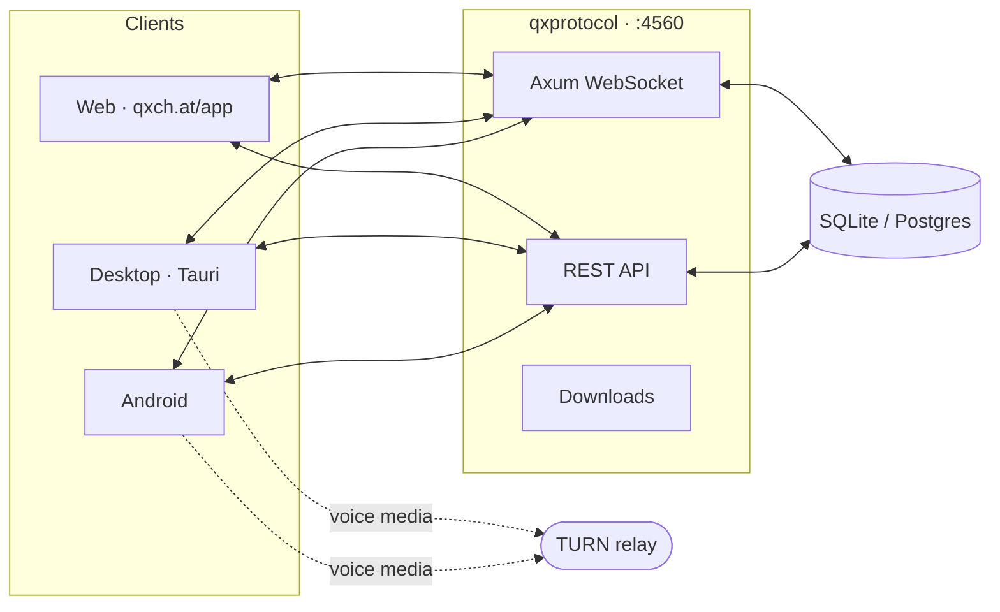

<div align="center">
  

  # LQXP Protocol Server

  **The lightweight, end-to-end encrypted messaging backbone behind QxChat. Rooms, voice, and cryptographic privacy — self-hosted in minutes.**

  [](./LICENSE)
  [](./rust)
  [](./explain/04-message-transport.md)
  [](./explain/06-cryptographic-primitives.md)
  [](./files/config.example.toml)
  [](./Dockerfile)
  [](./explain/05-phantom-protocol.md)

  <a href="https://qxch.at/app"><strong>Try the web app</strong></a>
  ·
  <a href="https://getqxchat.com/download">Download</a>
  ·
  <a href="https://getqxchat.com/wiki">Wiki</a>
  ·
  <a href="https://discord.wf/qxchat">Discord</a>
  ·
  <a href="https://github.com/lqxp">GitHub</a>
</div>

---

## What is LQXP?

**LQXP** (Light Quantum X Protocol) is an open, IRC-inspired messaging protocol with end-to-end encryption at its core — and this repository is its reference server, written in Rust. It relays rooms, messages, presence, voice signaling, and files **without ever seeing plaintext**: every payload is encrypted client-side before it touches the wire.

> Rooms are ephemeral. Keys stay with you. The server sees nothing.



---

## Features

### Transport & cryptography
- ★ **Blind relay core** — the server stores ciphertext, routes frames, and enforces rate limits. No plaintext, no metadata mining.
- ★ **Post-quantum ready** — ML-KEM-768 key exchange and ML-DSA/SLH-DSA signatures alongside ECDSA P-256 ([primitives](./explain/06-cryptographic-primitives.md)).
- ★ **QXP-PHANTOM** — the ghost-rendezvous friend protocol: blind mailbox slots, sealed envelopes, opaque blocking ([spec](./explain/05-phantom-protocol.md)).
- ★ **QxCloudSync** — device-to-device sync over the same blind relay: hybrid PQ handshake, epoch keys, self-healing mesh ([spec](./explain/09-qxcloudsync.md)).
- ★ **Tor-friendly** — clients can route through Tor; relay directory and circuit views included.

### Messaging & calls
- ★ **Rooms & DMs** — tokens, roles, pins, threads, polls, whiteboard, spoiler particles.
- ★ **Voice calls** — WebRTC peer-to-peer audio with TURN relay fallback and per-user volume.
- ★ **Files & media** — images, audio, video, arbitrary files, link previews — encrypted like any message.
- ★ **Pseudonymous accounts** — username-based identity, 12-word recovery, no email or phone required.

### Operations
- ★ **One binary** — `qxprotocol`, configured by a single TOML file, SQLite out of the box, Postgres when you grow.
- ★ **Docker & bare metal** — Compose stack, systemd units, PM2 and Pelican recipes included.
- ★ **Built-in web client** — the server owns a web checkout and rebuilds it on every startup; zero separate frontend deploy.
- ★ **Anti-abuse baked in** — rate limits, quota tokens, VDF + CAPTCHA challenges, Privacy Pass ([details](./explain/07-anti-abuse.md)).

---

## Repositories

| Repository | Stack | Description |
|---|---|---|
| [`lqxp/lqxp`](https://github.com/lqxp/lqxp) | Rust | This server — the protocol reference implementation. |
| [`lqxp/client`](https://github.com/lqxp/client) | Vue 3 | Official web client: in-browser E2EE, WebRTC calls, offline-capable UI. |
| [`lqxp/app`](https://github.com/lqxp/app) | Tauri · Nix | Packaged desktop (Linux, macOS, Windows) and Android app with reproducible builds. |
| [`lqxp/site`](https://github.com/lqxp/site) | Nuxt | [getqxchat.com](https://getqxchat.com) — landing, wiki, and downloads. |
| [`qxchat.ts`](https://www.npmjs.com/package/qxchat.ts) | TypeScript | High-performance selfbot SDK for QXChat, native for Bun. |

---

## Quickstart

Prerequisites: Rust 1.88+, `git`, `bun`, and a writable `QXP_ROOT` with outbound access to GitHub and the Bun registry.

```sh
git clone https://github.com/lqxp/lqxp
cd lqxp
cp files/config.example.toml files/config.custom.toml
$EDITOR files/config.custom.toml   # [api], [web], [network], [rtc], [database], [security]
cargo run --release
# Server listens on :4560 — open http://localhost:4560/app/
```

First boot with an empty database refuses to start on purpose: add `createIfMissing = true` under `[database]` once, start, then remove it. For production updates on bare metal, `./update.sh` pulls, rebuilds, and restarts via PM2.

### Docker

```sh
docker compose up -d --build
# mounts: files/config.custom.toml (ro), files/qxp.sqlite, files/database.json
```

Deployment guides: [Docker](./docs/docker-deployment.md) · [TURN](./docs/turn-deployment.md) · [`deploy/`](./deploy) (systemd, PM2, Pelican, TURN).

---

## Protocol reference

The [`explain/`](./explain) directory is the deep technical reference — the same source material as the public [wiki](https://getqxchat.com/wiki):

| Doc | Covers |
|---|---|
| [01 · Architecture](./explain/01-architecture.md) | Client/server state model and component map |
| [02 · Accounts & auth](./explain/02-account-authentication.md) | Registration, login, recovery, sessions |
| [03 · Client signatures](./explain/03-client-signature-protocol.md) | Device keys, contextual keys, hybrid signatures |
| [04 · Message transport](./explain/04-message-transport.md) | WebSocket opcodes and the E2EE envelope |
| [05 · PHANTOM](./explain/05-phantom-protocol.md) | Friend rendezvous: prekeys, slots, envelopes, roster |
| [06 · Primitives](./explain/06-cryptographic-primitives.md) | Exact hashes, KDFs, ECDSA, ML-DSA-65, ML-KEM-768 |
| [07 · Anti-abuse](./explain/07-anti-abuse.md) | Rate limits, quota tokens, VDF, CAPTCHA, Privacy Pass |
| [08 · Changes](./explain/08-protocol-changes.md) | Spec-vs-shipped gap report and changelog |
| [09 · QxCloudSync](./explain/09-qxcloudsync.md) | Blind-relay device sync, epochs, deepMerge |

---

## Configuration surface

| Section | Purpose |
|---|---|
| `[api]` | Public domain, ports, hosted entry points |
| `[web]` | Web client source (`repo`, `directory`, `fresh`, or pinned `tag`) |
| `[network]` | Upload dir, public dir, embedded webchat index |
| `[rtc]` | TURN servers, relay-only mode, call switches |
| `[database]` | SQLite path / Postgres URL, `createIfMissing` |
| `[security]` | Captcha, VDF difficulty, Privacy Pass, abuse thresholds |

Desktop/mobile client builds additionally accept `QXP_SERVER_ORIGIN`, `QXP_API_BASE_URL`, `QXP_WS_URL`, `QXP_TURN_URLS`, `QXP_TURN_USERNAME`, `QXP_TURN_CREDENTIAL`, `QXP_CALLS_ENABLED` (see `lqxp/app` CI secrets).

---

<div align="center">
  <sub>Built on Internet · Open source · No tracking</sub>
  <br />
  <a href="https://qxch.at/app">qxch.at/app</a>
  |
  <a href="https://getqxchat.com/download">download</a>
  |
  <a href="https://getqxchat.com/wiki">wiki</a>
  |
  <a href="https://discord.wf/qxchat">discord.wf/qxchat</a>
  |
  <a href="https://github.com/lqxp">github.com/lqxp</a>
</div>
